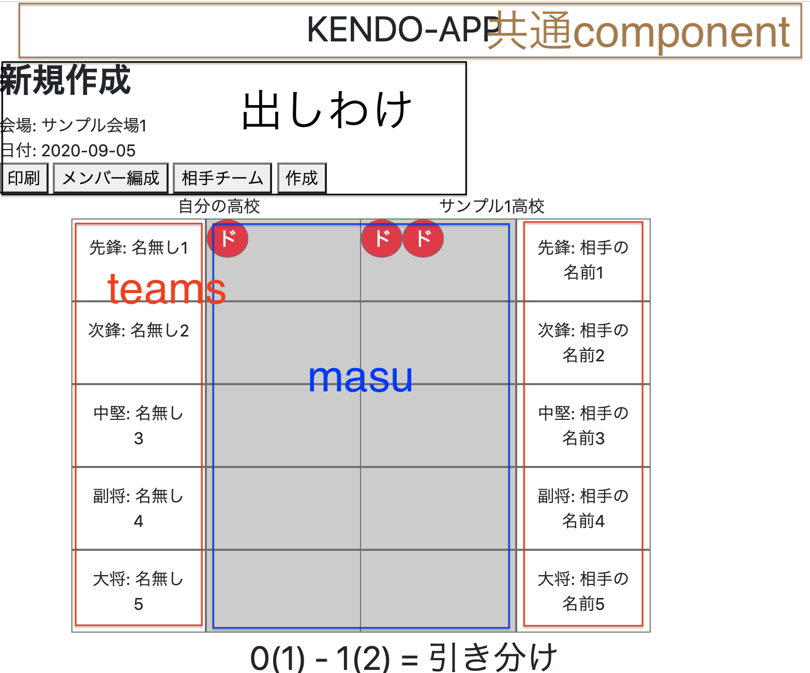

### Vueとrailsを使った開発
---
### 自己紹介
**名前**：ゆうき      

**仕事**：現在Webの受託開発としてフロントをメインで触ってます。

先月SES会社から転職し、 
7/16(木)入社

---
### 実際に作ったもの

<a href="https://yojigen-app.herokuapp.com/" target="_blank">リンク</a>

---
### 初期構想

仕事にジョインしたてだったのでついて行けるように全ての技術を詰め込もう

Vue, Vuex, Typescript, Rails, Docker, AWS

---
### 実際に使った技術

Vue, Rails, AWS

めっちゃ削ぎ落とした

---
### やってみた感想

Vueの基礎のみ使ったことで、Vuexのが向いてるパターンやtypescriptで型指定したい場合などが自分で考えられる

---
### ER図(テーブル)
  
---
### 今回一番感動したポイント
- コンポーネント思考ってすげー
- 共通部品はどんどん使い回そう

---
### コンポーネント思考ってすげー

---?code=app/javascript/src/router.js&lang=javascript&title=front routing

@[20-22](同一のコンポーネント)
---
  

---

---
### 利点

- これにより一度修正してしまえば多画面一気に修正することが可能

- コンポーネント設計をすると同じ見た目部品は使い回そうという思考になる

### 注意点
- 中身のデータ部分を親から渡してあげる必要がある

---
### 共通部品はどんどん使い回そう
vueではslotという機能がある

---?code=app/javascript/src/components/parts/BaseModal.vue&lang=javascript&title=slot function

---?code=app/javascript/src/components/home/addPlaceModal.vue&lang=javascript&title=how to use

---
### まとめ

VueのことはわかったがRails全然わからない
---
最後までありがとうございました。